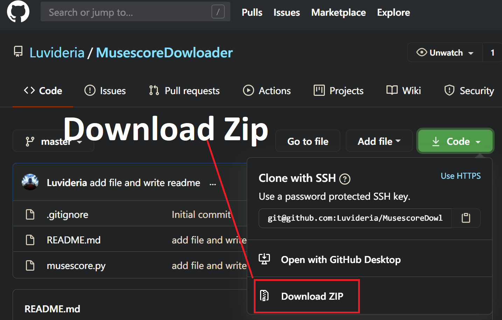
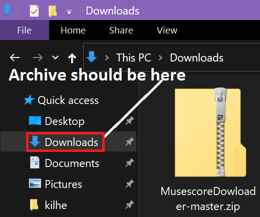
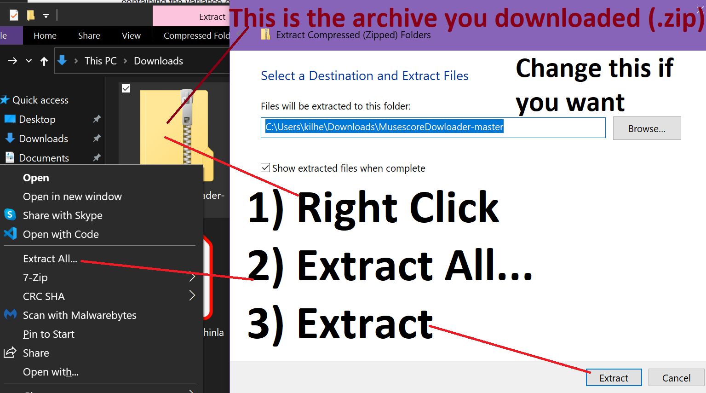
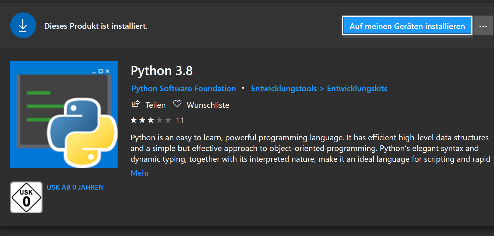

## MusescoreDowloader
Creates PDFs from musescore's svgs/pngs from url

It's a python script. Finds a few keywords and extracts the links, then using the libraries, it creates svg/png files and creates a pdf out of it.

## Beginner instructions:
These instructions are targeted to music people who don't know coding but want those sweet sheets.
Mainly for windows users, but other OS would use similar steps.

Download the project

Open the explorer, you should find it in Downloads

Can be somewhere else. Type Ctrl+J in your browser, it's your download page, from here, try to find where the archive is located.

You can also drag and drop or copy paste from within the archive into another directory. Just be sure to know where to find it.

You need to go inside the directory.

Open the powershell window. Type `python` inside. 

Normally, the appstore should pop up:

If it doesn't appear, go on the microsoft store yourself and type python3. Select the version 3.7 or 3.8, it doesn't matter for this script.
If you do not have the microsoft store, or you are running an older version of windows, you need to install python by yourself (don't worry, it's a few clicks away: [download page](https://www.python.org/downloads/))

Once it's installed, go back to the powershell and type `pip`.
If you see some text, it means it worked. If it doesn't work, or you see red text, close the window and open it again like we did previously. Try to type `pip` again. If it doens't work, either python is not installed (let it finish!), or it is not in the path.
Use your favourite search engine to find how to add python in the Path for windows.

You should have some downloading going on, let it finish, it should be quick.
Now everything is ready!
Go to musescore.com and get the link as follows

Type in your link instead of the example one:

You can specify in which directory you want your output file(s) after the link.
You can also get the midi file (not always available) by typing something after the directory ( put a dot for the directory if you don't want to type one specifically but want the midi)

Check below for examples.

## Not-Beginner instructions

To run this program you will need:

`pip install svglib fpdf pypdf2`

or with conda:

`conda install -c conda-forge svglib pypdf2`

sadly fpdf doesn't have a reliable release, but "-c viascience fpdf" looks ok

**Usage**: 
1) go on musescore.com and find the sheet you want

2) Copy the url, this is the inputUrl

3) Use the following command with your inputUrl
### `python musescore.py inputUrl destinationDirectory MidiTrueFalse`

*inputUrl* is the url from musescore
*destinationDirectory* is where the sheet will be written
*MidiTrueFalse* is 1 if the midi file should be downloaded, 0 or empty otherwise
example:

`python ./musescore.py https://musescore.com/user/4609986/scores/1749181`

will put the sheet in the current directory

`python ./musescore.py https://musescore.com/user/4609986/scores/1749181 chopin`

will put the sheet in the chopin directory. Will be created if does not exist.

`python ./musescore.py https://musescore.com/user/4609986/scores/1749181 chopin 1`

will put the sheet and midi file in the chopin directory, will be created if does not exist. You can use "." (dot) if you want to use the current directory